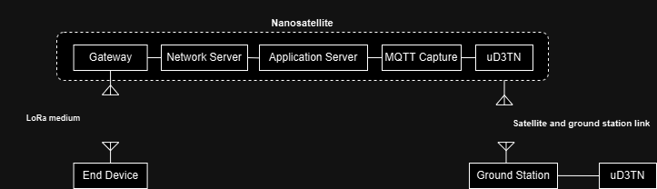

## LoRaWAN-DTN Integration with LWN Simulator, ChirpStack, and uD3TN

This project simulates a LoRaWAN environment using **LWN Simulator**, manages data with **ChirpStack**, and integrates with **uD3TN** for DTN-based IoT applications. The architecture is ideal for environments with intermittent connectivity, such as Direct-to-Satellite IoT (DtS-IoT).

---

## Table of Contents
1. [Introduction](#introduction)
2. [Requirements](#requirements)
3. [Getting Started](#getting-started)
4. [Usage Instructions](#usage-instructions)
   - [Setup LWN Simulator](#setup-lwn-simulator)
   - [Deploy ChirpStack Using Docker](#deploy-chirpstack-using-docker)
   - [Capture MQTT Data and Forward to uD3TN](#capture-mqtt-data-and-forward-to-ud3tn)
5. [DtS-IoT Integration](#dts-iot-integration)
6. [Alternative Approach: UDP Data Capture](#alternative-approach-udp-data-capture)
7. [References](#references)

---

## Requirements
1. Docker (for ChirpStack deployment).
2. Python 3.x and libraries (`paho-mqtt`).

---

## Getting Started
1. Clone this repository: `git clone ...`
2. Install Docker and Python dependencies.
3. Run LWN Simulator to simulate LoRaWAN devices.
4. Deploy ChirpStack using Docker for data management.
5. Use `mqtt_to_ud3tn.py` to integrate MQTT with uD3TN.

---

## Usage Instructions

### 1. Setup LWN Simulator
LWN Simulator creates a virtual LoRaWAN environment with devices, forwarders, and gateways.

1. **Installation**:
   - Clone the repository:
     ```bash
     git clone https://github.com/scapingerman/lorawan_sim_ud3tn.git
     cd lorawan_sim_ud3tn
     ```
2. **Run the simulator**:
   - Navigate to the simulator directory and execute:
     ```bash
     cd lwnsimulator_x64
     ./lwnsimulator_x64
     ```
   - For more [LWN Simulator README](https://github.com/UniCT-ARSLab/LWN-Simulator#installation).
     
3. **Features**:
   - Supports LoRaWAN v1.0.3 specification.
   - Allows customization of payloads, MAC commands, and device classes (A, B, C).

---
### 2. Deploy ChirpStack Using Docker

ChirpStack is an open-source LoRaWAN Network Server stack.

1. **Start the Docker containers:**

   ```bash
   cd chirpstack-docker
   sudo docker-compose up
   ```

2. **Configuration:**

  -  Edit configuration/chirpstack/chirpstack.toml to adjust the regional settings if needed.
  -  Use the provided docker-compose.yml as a base and modify it for production as necessary.

3. **Components:**
   -  ChirpStack Gateway Bridge: Connects gateways to the Network Server.
   -  ChirpStack Network Server: Processes and routes LoRaWAN packets.
   -  ChirpStack Application Server: Publishes received data to an MQTT topic.

### 3. Capture MQTT Data and Forward to uD3TN
  -  To integrate MQTT data into a DTN architecture, use the mqtt_to_ud3tn.py script. This script captures MQTT messages from ChirpStack, converts them into DTN bundles, and forwards them to a remote uD3TN node. At the destination, these bundles can be extracted and retransmitted as MQTT messages.

  ```bash
  python3 mqtt_to_ud3tn.py
  ```
1. **How It Works:**:
    - MQTT Topic: The MQTT_TOPIC variable in the script corresponds to the topic where ChirpStack publishes data.
For example:

 ```bash

application/400d3f3b-c7ea-4d4d-8ac5-f7f1b4bcc34e/device/8e2f811d9394fe0d/event/up

 ```
  -  400d3f3b-c7ea-4d4d-8ac5-f7f1b4bcc34e
This is the Application ID assigned when configuring the application in ChirpStack.

  -  8e2f811d9394fe0d

This is the End Device ID, representing the specific LoRaWAN device transmitting data.

  -  Data Flow: The script captures messages from the MQTT broker, extracts the payload, and sends it to a uD3TN node using the aap2_send.py tool.

2. **MQTT Data Capture in the LoRaWAN Architecture:**
Below is a diagram illustrating where the MQTT data is captured in the typical LoRaWAN architecture:

 ```bash
End Device --> Gateway --> Network Server --> Application Server --> [MQTT Broker] --> uD3TN
 ```

End Device: Sends LoRa frames to the Gateway.

Gateway: Forwards frames to the Network Server.

Network Server: Processes frames, applies network rules, and forwards the data to the Application Server.

Application Server: Publishes processed data to the MQTT Broker.

MQTT Broker: Serves as a bridge between LoRaWAN and DTN architectures by converting MQTT messages into DTN bundles, ensuring reliable data delivery in delay-tolerant networks.


### Next Step
 **Scale the setup:**
 -  Use physical gateways and end devices (e.g., RAK2287, Heltec LoRa V3).

# Integrating the MQTT-to-uD3TN Workflow into a Direct-to-Satellite IoT (DtS-IoT) Scenario

Building upon the strengths of LoRaWAN architectures and DTN protocols, the following outlines how MQTT-to-uD3TN integration aligns with a DtS-IoT scenario:

---

## DtS-IoT Integration

### Background
The study highlights a LoRaWAN-based DtS-IoT architecture where devices transmit data to satellites. LoRaWAN consists of multiple layers:
- **Network Server:** Handles authentication and routing.
- **Application Server:** Manages data processing and presentation.

A key challenge is efficiently managing intermittent connections between satellites and ground stations while ensuring reliable data transmission.

---

### Proposed Integration
Using the MQTT-to-uD3TN workflow, this integration bridges LoRaWAN and DTN capabilities for robust data delivery.

#### **1. Data Capture at the Application Server**
- MQTT data is captured at the **Application Server**, which serves as the intermediary between the LoRaWAN network and external systems.
- Example: Capturing data from a ChirpStack server topic.

#### **2. Transformation into DTN Bundles**
- Captured MQTT data is processed using uD3TN tools (e.g., `aap2_send.py`), transforming it into DTN bundles.  
- These bundles ensure resilience to delays and disruptions, critical for DtS-IoT.

#### **3. Transmission over DTN**
- Bundles are forwarded to a destination node, such as:
  - Another uD3TN instance on a satellite.
  - A ground station node.
- This ensures reliable delivery, even with intermittent connectivity.

---

### **Diagram**




---

### **Benefits**
1. **Seamless Integration:** Leverages the modularity of LoRaWAN and DTN architectures.
2. **Robustness to Disruptions:** Ensures message integrity on lossy satellite links.
3. **Scalability:** Accommodates thousands of devices, addressing scalability concerns.

---

### **Next Steps**
1. Test the workflow with real LoRaWAN hardware (e.g., Heltec nodes and RAK gateways).
2. Simulate satellite-ground link dynamics to evaluate bundle delivery performance.
3. Explore advanced DTN configurations (e.g., fragmentation and reassembly) for large payload optimization.

This integration combines MQTT processing with the DtS-IoT model, paving the way for scalable and reliable satellite IoT networks.

---


## Alternative Approach: UDP Data Capture

### Objective
Capture raw UDP data transmitted between the LoRaWAN Gateway and Network Server to process and forward it as DTN bundles.

---

### Approach
1. **Interception of UDP Packets**
   - Used `tcpdump` to monitor traffic on port 1700:
     ```bash
     sudo tcpdump -i <interface> udp port 1700
     ```
   - Verified the presence of UDP packets between the gateway and the Network Server.

2. **Direct Processing of UDP Data**
   - Wrote a Python script to capture these packets, process their payload, and format them into DTN bundles for transmission using `aap2_send.py`.

## References
- [LWN Simulator Documentation](https://github.com/UniCT-ARSLab/LWN-Simulator#readme)
- [ChirpStack Documentation](https://www.chirpstack.io/)
- [uD3TN Repository](https://github.com/dtn7/uD3TN)


